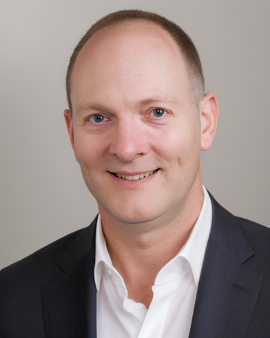

---
styles:
  - message-wrap
---

## Message from Founder and Director

  <figure class="image-wrap">
    
    <figcaption>Dr. Christopher T. Whitlow, MD, PhD, MHA</figcaption>
  </figure>
  <blockquote class="content">
    
"Welcome to RIIPL, a research group within the Atrium Wake Forest Baptist Health Department of Radiology. Our lab is dedicated to advancing the frontiers of medical imaging through the application of cutting-edge image analysis methods, including diffeomorphic registration, machine learning and AI development, graph theory analysis, and arterial spin labeling (ASL). At the heart of our mission is not just the development of these novel techniques, but their robust translation into clinical practice, improving patient care and outcomes.

    
Our team is comprised of a diverse group of experts—biomedical engineers, MR physicists, clinical radiologists, programmers—and a dynamic mix of students from various fields, all united by a shared passion for transforming healthcare. Our collaborative spirit extends beyond our lab, as we actively engage with a wide array of research groups, contributing our imaging expertise to studies in aging and dementia, radiation exposure, traumatic brain injury, and the health impacts of diet and exercise."

  </blockquote>






## Highlights
****


Our lab specializes in integrating cutting-edge neuroimaging analysis into studies of aging, diet, traumatic brain injury, and more. We pride ourselves on our extensive portfolio of recent publications, highlighting our ongoing contributions to various fields of research.









From groundbreaking ongoing research projects to the exceptional work of our students and faculty. This space highlights our latest abstracts, posters, and speaking engagements, along with innovative software projects aimed at enriching the open-source community.









Our Team is the cornerstone of our lab, comprising a vibrant mix of individuals from various disciplines united by a shared passion for neuroimaging research. Here, you can learn about each member's role, their specific research interests, and the unique contributions they bring to our collective pursuit of knowledge. Our lab thrives on the diversity of thoughts, skills, and interests each person contributes, making us a robust and dynamic force in the field.





